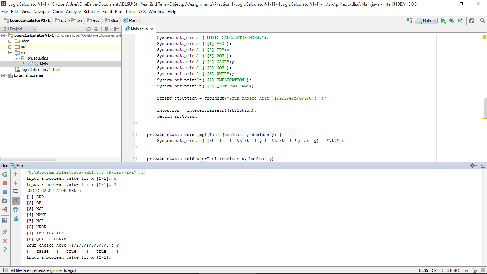

#LogicCalculatorV1-1

Modified Logic Calculator

#ScreenShot

#Code

~~~
package ph.edu.dlsu;

import java.io.*;

public class Main {

    public static void main(String[] args) throws IOException {

        int intOption = 0;

        while (intOption != 8) {

            String p = getInput("Input a boolean value for X [0/1]: ");
            String q = getInput("Input a boolean value for Y [0/1]: ");

            boolean X = Boolean.parseBoolean(convert2Boolean(p));
            boolean Y = Boolean.parseBoolean(convert2Boolean(q));

            intOption = getIntOption();

            switch (intOption) {
                case 1:
                    andTable(X, Y);
                    break;
                case 2:
                    orTable(X, Y);
                    break;
                case 3:
                    xorTable(X, Y);
                    break;
                case 4:
                    nandTable(X, Y);
                    break;
                case 5:
                    norTable(X, Y);
                    break;
                case 6:
                    xnorTable(X, Y);
                    break;
                case 7:
                    impliTable(X, Y);
                    break;
                case 8:
                    System.out.println("Program Terminated.");
                    break;
                default:
                    System.out.println("Input cannot be recognized.");
                    break;

            }

        }
    }

    private static String convert2Boolean(String input) {
        return (input.equals("0")) ? "false" : "true";
    }

    private static int getIntOption() {
        int intOption;
        System.out.println("LOGIC CALCULATOR MENU:");
        System.out.println("[1] AND");
        System.out.println("[2] OR");
        System.out.println("[3] XOR");
        System.out.println("[4] NAND");
        System.out.println("[5] NOR");
        System.out.println("[6] XNOR");
        System.out.println("[7] IMPLICATION");
        System.out.println("[8] QUIT PROGRAM");

        String strOption = getInput("Your choice here [1/2/3/4/5/6/7/8]: ");

        intOption = Integer.parseInt(strOption);
        return intOption;
    }

    private static void impliTable(boolean x, boolean y) {
        System.out.println("|\t" + x + "\t|\t" + y + "\t|\t" + !(x && !y) + "\t|");
    }

    private static void xnorTable(boolean x, boolean y) {
        System.out.println("|\t" + x + "\t|\t" + y + "\t|\t" + !(x ^ y) + "\t|");
    }

    private static void norTable(boolean x, boolean y) {
        System.out.println("|\t" + x + "\t|\t" + y + "\t|\t" + !(x || y) + "\t|");
    }

    private static void nandTable(boolean x, boolean y) {
        System.out.println("|\t" + x + "\t|\t" + y + "\t|\t" + !(x && y) + "\t|");
    }

    private static void xorTable(boolean x, boolean y) {
        System.out.println("|\t" + x + "\t|\t" + y + "\t|\t" + (x ^ y) + "\t|");
    }

    private static void orTable(boolean x, boolean y) {
        System.out.println("|\t" + x + "\t|\t" + y + "\t|\t" + (x || y) + "\t|");
    }

    private static void andTable(boolean x, boolean y) {
        System.out.println("|\t" + x + "\t|\t" + y + "\t|\t" + (x && y) + "\t|");
    }

    private static String getInput(String prompt) {
        BufferedReader stdin = new BufferedReader(
                new InputStreamReader(System.in));

        System.out.print(prompt);
        System.out.flush();

        try {
            return stdin.readLine();
        } catch (Exception e) {
            return "Error: " + e.getMessage();
        }
    }

}

~~~
